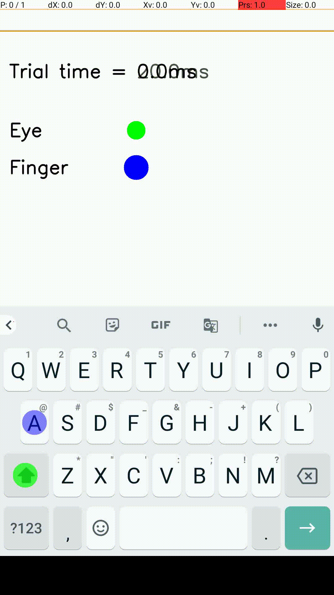

# The Impact of Key Height on Typing Behavior: An Experiment of Typing Performance on Daily Used Smartphone Keyboards

This repository contains the project work in "ELEC-E7861 - Research Project in Human-Computer Interaction" in Aalto University in 2023. This project is built based on the TypeAgent project, the original work can be seen in [TypingAgent](https://github.com/aditya02acharya/TypingAgent.git)


## Demo of the model



## Getting Started

These instructions will get you a copy of the project up and running on your local machine for development and testing purposes.

### Prerequisites

Project uses Anaconda for open source python distribution. Goto https://www.anaconda.com/ for installation.

The project also uses GPU for training neural network based AI agents. For GPU support follow the link below

`https://docs-cupy.chainer.org/en/stable/install.html#install-cupy`

### Installing

```
git clone https://github.com/quintus0505/TypingAgent_Aalto_Research_Project.git
```

Project provides an anaconda environment setup file to install project prerequisites.
Run the command below in the project directory.

```
conda env create -f configs/env_setup.yml
```

This command creates the anaconda environment **typing**. Use to command below to activate the environment.

```
conda activate typing
```

### Running the scripts

To train the agents, use the command below. Please check and edit the configuration files before running the scripts.

```
python main.py --train --all --config config.yml
```

To evaluate the trained agent on chi21 keyboard, use the command below. We have four keyboard options: chi, Gboard, Swiftkey, Go. Three key height choices: small medium, large.

```
python main.py --all --config config.yml --type "hello world>" --kbd chi
```

To evaluate the trained agent on kbd1k, use the command below, the number indicate the index of the keyboard, like 00 for Gboard.

```
python main.py --all --config config.yml --type "hello world>" --kbd Gboard --key_height large
```

To see all available argument, use the command below.

```
python main.py --help
```

### Run evaluation testing for a dataset of sentences
Input is required as a `.csv` file. The input file need to be in the same folder. Look at example in [`sentences.csv`](sentences.csv)
Run an evaluation testing with a certain amount of sentences with the command below:
```bash
python type_from_csv.py
```
It is possible to define how many sentences you want the agent to type from the input file, by adjusting the parameter `--ns`, as the below example. On default, the agent will type the first 15 sentences from [`sentences.csv`](sentences.csv)
```bash
python type_from_csv.py --ns 10
```
Output is stored as a [`results.csv`](typefromcsvres/results.csv) - A record of typing performance data, includes all the metrics.

### Statistic Analysis
Statistic analysis can be done in [`statistic.ipynb`](statistic.ipynb) to calculate the `mean` and `standard deviation` in five metrics: `iki(ms)`, `wpm`, `backspaces` (bs), `immediate backspaces` (immediate-bs) and `delayed backspaces` (delayed-bs). This is a Jupyter notebook allows to use any pandas syntax to analyze the test results. The boxplots graphs for five metrics can be found as `.png` figures in [`/typefromcsvres`](typefromcsvres)

### Configuration setting

All project configuration files are kept under configs folder.

- **config.yml**: this is the main configuration file. You can link config files for experiments here.
- **device_config.yml**: this file contains the device configuration. For example, layout configuration, key size, etc.
- **logging.yml**: centralised project logging configuration. Set logging mode to either `INFO`, `DEBUG`, `WARN`, `CRITICAL`. Logs are stored under logs directory.
- **training_config.yml**: model training configuration for each agent.
- **evaluation_config.yml**: model testing configuration for each agent.

### Project Storage

- **configs**: contains all configuration files.
- **data**: contains model outputs. Trained agent data kept under `models`. Test/Evaluation data kept under `output`.
- **layouts**: contains keyboard layouts. Layouts are stored as 2d-numpy array.
- **logs**: contains log files.
- **src**: contains project code base.

## Playing around the model via user interface

These instructions will help to evaluate and train the model on the browser of your local machine (preferably Chrome).
To start the UI, you will need to open **2 terminals** using commands below for starting frontend and backend respectively.

### Starting backend

Run the command below in the project directory.

```
conda env create -f configs/env_setup.yml
```

This command creates the anaconda environment **typing**. Use to command below to activate the environment.

```
conda activate typing
```

This command starts the backend on localhost:5000

```
flask run
```

### Starting frontend

Go to the **UI** directory.

```
cd UI
```

Run the command below in the **UI** directory for installing required libraries.

```
npm install @craco/craco --save
```

```
npm install --save react-scripts@2.1.8
```

This command starts the frontend on localhost:3000

```
npm start
```

Please wait for around 20s, and the landing page http://localhost:3000/#/ will be automatically opened on your browser.

## Authors and contributors of this research project
- **Yujun Zhu**
- **Helena Kirsta**

## Authors of the original paper

- **Jussi P.P. Jokinen**
- **Aditya Acharya**
- **Mohammad Uzair**
- **Xinhui Jiang**
- **Antti Oulasvirta**

## Contributors of the original repo

- **Jussi P.P. Jokinen**
- **Aditya Acharya**
- **Mohammad Uzair**
- **Anqi Yang**

